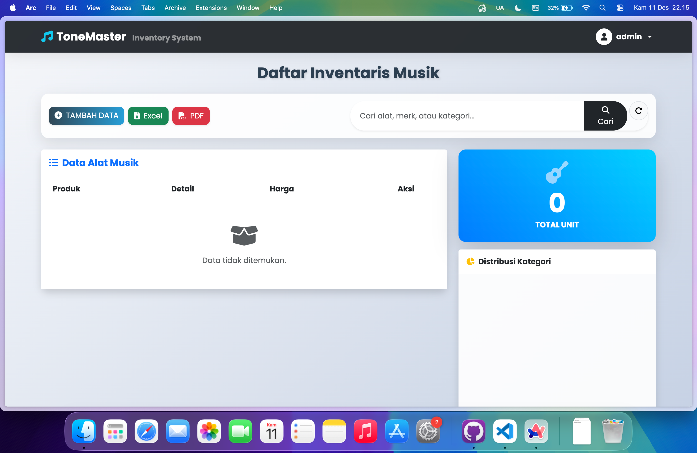

# 🎸 ToneMaster Inventory System

Aplikasi Manajemen Inventaris Alat Musik berbasis Web.

## 🚀 Fitur Utama
*   **CRUD** Barang (Create, Read, Update, Delete).
*   **Upload Gambar** Produk.
*   **Search** (Pencarian Data).
*   **Export Laporan** ke Excel & PDF.
*   **Dashboard Statistik** (Chart.js).

## 🛠️ Teknologi
*   Java 25 (OpenJDK)
*   Spring Boot 3.4
*   PostgreSQL
*   Thymeleaf + Bootstrap 5
*   **Quality Assurance:** 100% Unit Test Coverage (JaCoCo).

## 📸 Screenshots

